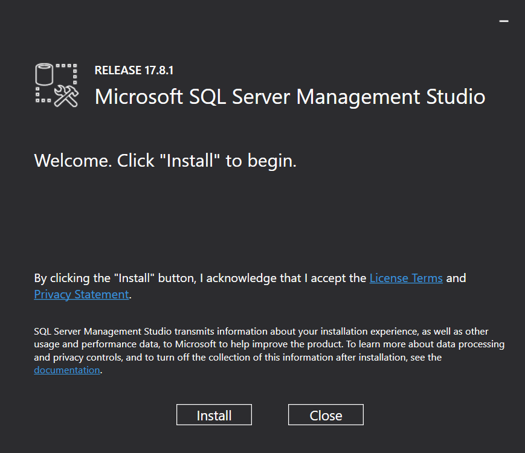

# SQL Server skal installeres

Vores maskiner _kan_ have __SQL Server Management Studio__ installeret, men det er en ældre version, og _kun_ Management Studio, elle database serveren. Så den skal downloades og installeres.

## Find serveren
1. På <https://www.microsoft.com/da-dk/sql-server/sql-server-downloads> vælg _udvikler_ (<https://go.microsoft.com/fwlink/?linkid=853016>)
1. Kør den downloadede installationsfil
1. Accepter licens osv.
1. Vælg Standard
1. Hvis den siger der er en fil der skal repareres, se vejledningen, og opdater denne fil 
## Installer SQL Server Management Studio
1. Når installationen af Serveren er færdig får du denne slut-skærm. 
    * Vælg `Install SSMS`

1. Installer ...

## Den gamle SSMS
Skal man fjerne den?
